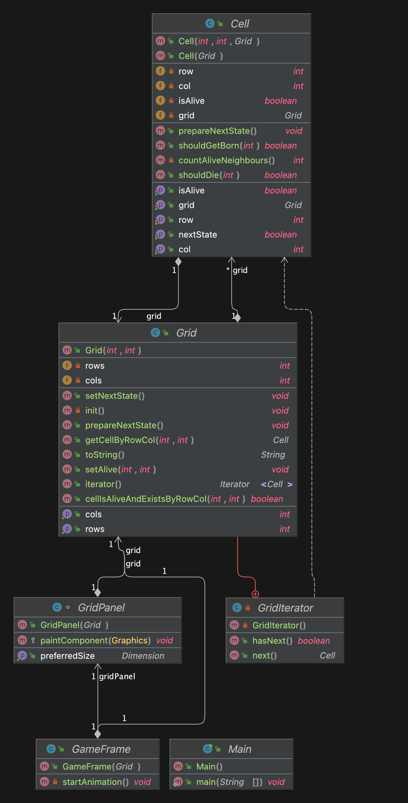

# Conway's Game of Life

This project implements Conway's Game of Life in Java using a Maven project structure. 
The Game of Life is a cellular automaton devised by John Horton Conway in 1970. 
It is a zero-player game, meaning its evolution is determined by its initial state, requiring no further input.

## Usage
1. Clone the repository or download the source code zip file.
2. Navigate to the project directory.
3. Compile the Maven project using `mvn compile`.
4. Package the project into a runnable JAR file using `mvn package`.
5. Run the JAR file with dependencies included using `java -jar target/your_project_name-1.0-SNAPSHOT-jar-with-dependencies.jar`.